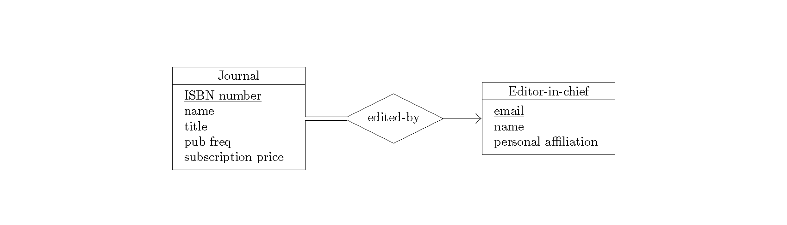
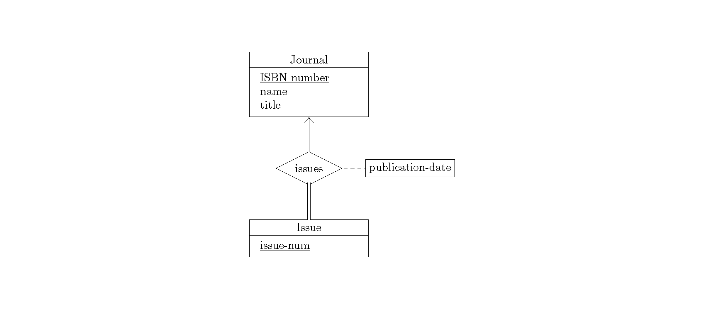
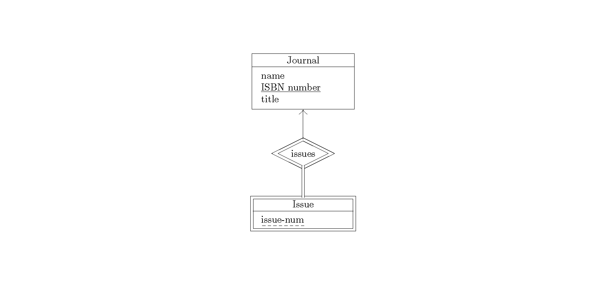

Examples
========

Adding entities
---------------

Adding the first entity to the diagram is easy: just create an ERDiagram
object with an existing entity:

.. code:: py

    from texonomy import Entity, ERDiagram

    # create an Entity
    journal = Entity("Journal", ["ISBN number", "name", "title"])

    # add it to the ER diagram
    diag = ERDiagram(journal)

    # write out the LaTeX code
    with open("example.tex", "w") as er:
        er.write(diag.to_latex())

Output
~~~~~~

Adding relationships
--------------------

As soon as there are multiple entities, you'll have to attach them using
Relationships:

.. code:: py

    from texonomy import Entity, ERDiagram, Relationship, Direction, MANY_TO_EXACTLY_ONE, EXACTLY_ONE_TO_MANY

    # create an entity
    journal = Entity("Journal", ["ISBN number", "name", "title", "pub freq", "subscription price"])

    # add it to the diagram
    diag = ERDiagram(journal)

    # create another entity
    editor = Entity("Editor-in-chief", ["email", "name", "personal affiliation"])

    # Add this relationship to the diagram. The new entity will be placed to
    # the right of the existing one, and its label will read "edited-by".
    diag.add_relationship(Relationship(journal, editor, "edited-by", MANY_TO_EXACTLY_ONE, Direction.RIGHT))

    # write out the LaTeX code
    with open("example.tex", "w") as er:
        er.write(diag.to_latex())

Output
~~~~~~

Adding relationships (with attributes)
--------------------------------------

.. code:: py

    from texonomy import Entity, Relationship, ERDiagram, EXACTLY_ONE_TO_MANY, Direction

    # create an entity
    journal = Entity("Journal", ["ISBN number", "name", "title"])
    issue = Entity("Issue", ["issue-num"])

    diag = ERDiagram(journal)

    diag.add_relationship(
        Relationship(journal, issue, "issues", EXACTLY_ONE_TO_MANY, Direction.BELOW, ["publication-date"])
    )

    with open("example.tex", "w") as er:
        er.write(diag.to_latex())

Output
~~~~~~

Adding specializations
----------------------

Specializations are similar to relationships, but they don't require using a
Relationship object. This example, in addition, sets the primary key of the
"author" entity to be "author-id" instead of the default, "name".

.. code:: py

    from texonomy import Entity, ERDiagram

    # create an entity
    author = Entity("Author", ["name", "author-id"])

    # set the primary, since we don't want it to be the default
    author.set_primary("author-id")

    # create another entity which will specialize from the author entity
    contact_author = Entity("Contact author", ["contact email"])

    # create an ER diagram with the author entity
    diag = ERDiagram(author)

    # add a specialization
    diag.add_specialization(author, contact_author)

    with open("example.tex", "w") as er:
        er.write(diag.to_latex())

Output
~~~~~~

Adding weak entities
--------------------

Working with weak entities isn't much different than regular entities. Just
specify True for the last argument to the Entity constructor, and specify any
defining relationship by passing True as the last argument to ``add_relationship()``.

.. code:: py

    from texonomy import Entity, Relationship, ERDiagram, EXACTLY_ONE_TO_MANY, Direction

    journal = Entity("Journal", ["name", "ISBN number", "title"])
    journal.set_primary("ISBN number")

    # Issue is a weak entity.
    issue = Entity("Issue", ["issue-num"], True)

    diag = ERDiagram(journal)

    # The last boolean param (optional) is set to true to indicate that this is a
    # defining relationship.
    diag.add_relationship(Relationship(journal, issue, "issues", EXACTLY_ONE_TO_MANY, Direction.BELOW), True)

    with open("example.tex", "w") as er:
        er.write(diag.to_latex())

Output
~~~~~~

